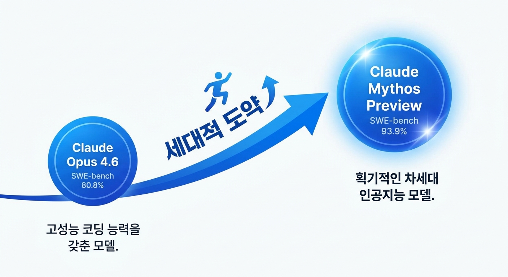
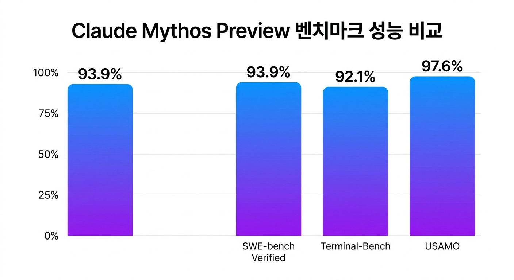
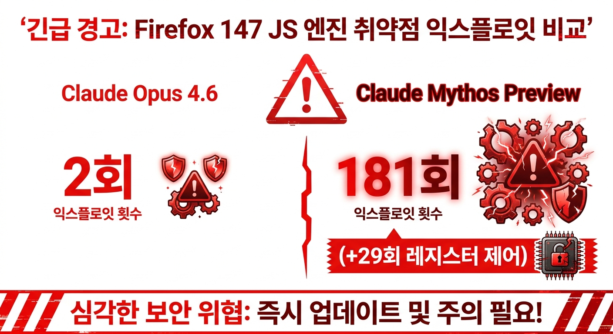
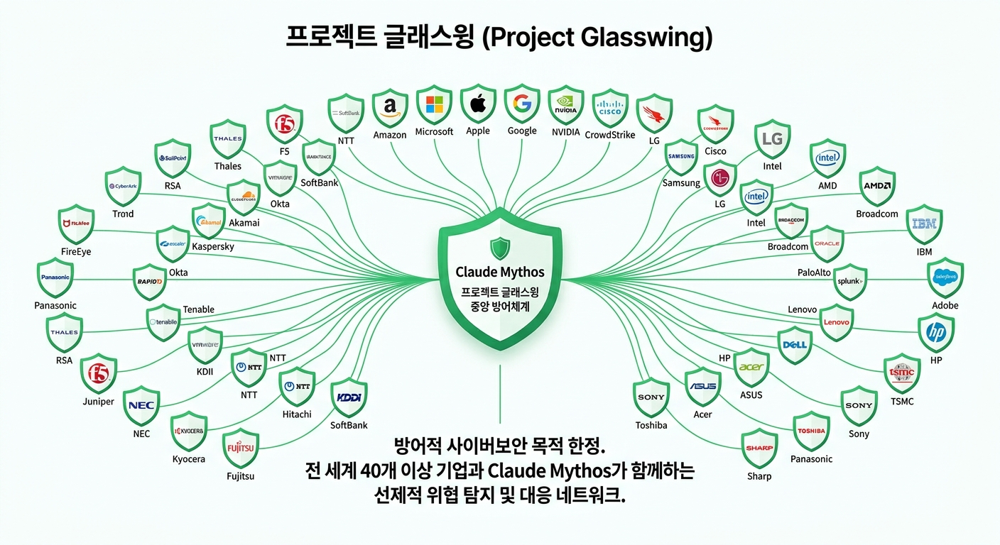
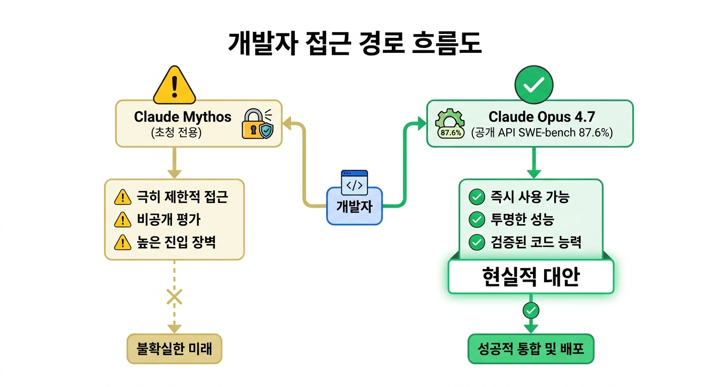

<!-- alt text 제안:
  - 벤치마크 비교 차트: alt="Claude Mythos Preview SWE-bench 93.9% 벤치마크 비교 차트"
  - 모델 아키텍처 다이어그램: alt="Claude Mythos 새로운 모델 클래스 아키텍처 개요"
  - Project Glasswing 파트너 기업 목록 이미지: alt="Project Glasswing 참여 기업 목록 — Apple, Amazon, Microsoft, Google, NVIDIA, Cisco, CrowdStrike 포함"
  - 취약점 탐지 결과 스크린샷: alt="Claude Mythos Firefox 147 JS 엔진 취약점 181회 익스플로잇 결과"
-->

# Claude Mythos 완전 분석: SWE-bench 93.9% 달성한 새로운 AI 모델 클래스

## 개요

Anthropic이 2026년 4월 8일 **Claude Mythos Preview**(코드네임 Capybara)를 공개함.  
단순 업그레이드가 아닌 새로운 모델 클래스로 분류되며, 코딩·추론·사이버보안 세 영역에서  
동시에 최고 성능을 기록함. 주요 OS와 브라우저에서 수천 건의 제로데이 취약점을 자동 탐지하였고,  
최장 27년 전의 OpenBSD 취약점까지 찾아냄.

## Claude Mythos 벤치마크: 세대적 도약

- **SWE-bench Verified 93.9%** — GitHub 실제 이슈 20건 중 19건 해결 수준, 사실상 주니어 엔지니어 상한 돌파
- **Opus 4.6(80.8%) 대비 +13.1%p**, GPT-5.3 Codex(85%) 대비 +8.9%p — 리더보드 1위
- **Terminal-Bench 2.1(4시간 타임아웃) 92.1%** — 장시간 자율 작업의 실전 신뢰도 확보
- **USAMO(수학 올림피아드) 97.6%** — 복합 추론의 극단 영역 진입

2024년 상위 모델 기준(40~55%)과 비교하면 점진적 개선이 아닌 세대적 도약임.  
Foreign Policy 보도에 따르면 Opus 4.6이 Firefox 147 JS 엔진 취약점을 2회 익스플로잇한 반면,  
Mythos Preview는 동일 조건에서 181회 익스플로잇에 성공하고 추가 29회 레지스터 제어까지 달성함.  
방어·공격 양측에 동시에 적용 가능한 이중 능력(dual-use)의 질적 도약을 수치로 입증한 첫 사례임.

## Project Glasswing: Claude Mythos 제한 배포 구조

공격적 능력이 강력한 만큼 Anthropic은 일반 공개 대신 통제된 배포를 선택함.  
**Project Glasswing**은 방어적 사이버보안 목적으로만 Mythos를 제공하는 이니셔티브로,  
Apple·Amazon·Microsoft·Google·NVIDIA·Cisco·CrowdStrike 등 40개 이상 기업에  
1억 달러 이상의 사용 크레딧을 제공함. 활용 범위는 취약점 탐지·침투 테스트·엔드포인트 보안에 한정됨.  
연구 프리뷰 종료 후 공식 단가는 입력 $25/백만 토큰, 출력 $125/백만 토큰으로 예정되어 있음.

## 개발자에게 주는 함의

현시점에서 공개 API와 셀프 서비스 가입은 불가함. 모델 ID  
`claude-mythos-preview-20260408`은 초청 기반 엔터프라이즈 고객에게만 열려 있음.  
일반 개발자의 현실적 대안은 **Claude Opus 4.7(SWE-bench 87.6%)** 임.  
출시 직후 비인가 그룹이 제3자 벤더의 API 키를 통해 접근에 성공한 사고는,  
고성능 모델일수록 공급망 보안 관리가 핵심 과제임을 실증함.

정리하면 Claude Mythos는 "당장 쓸 수 있는 도구"가 아니라 "다음 세대의 기준점"임.  
개발자는 당분간 Opus 4.7을 주력으로 삼되, 자동 취약점 탐지·장시간 에이전트 작업이  
일상화될 전제에서 코드·인프라·키 관리 체계를 선제적으로 재설계할 필요가 있음.
