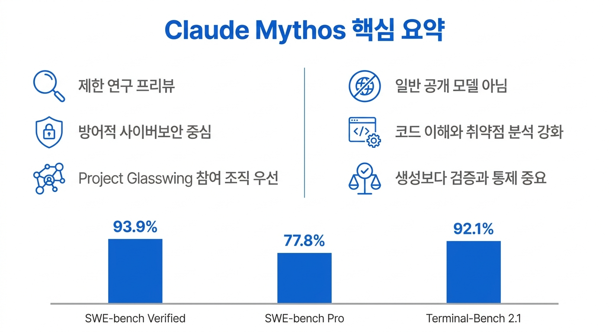
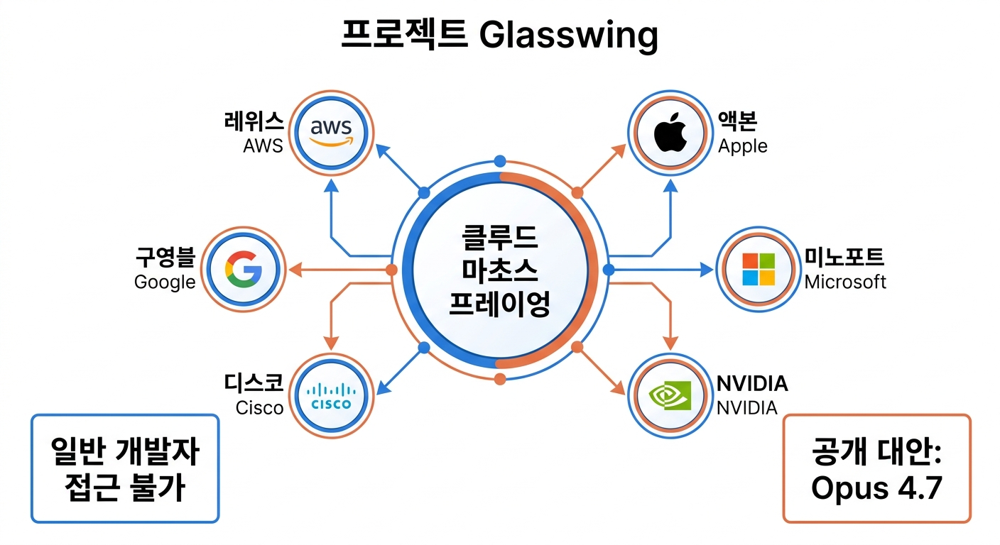

---  
title: "Claude Mythos 핵심 정리: 개발자가 봐야 할 제한 공개 AI 모델"  
meta_description: "Claude Mythos는 왜 공개되지 않았고, 개발자는 무엇을 준비해야 하는지 핵심만 정리한 개발자용 요약."  
keywords: ["Claude Mythos", "Claude Mythos Preview", "Project Glasswing", "Anthropic", "Opus 4.7", "AI 보안", "SWE-bench"]  
---  

# Claude Mythos 핵심 정리: 개발자가 봐야 할 제한 공개 AI 모델  

## Claude Mythos란 무엇인가  

Anthropic이 2026년 4월 7일 공개한 Claude Mythos Preview는 일반 공개 LLM이 아닌  
제한 연구 프리뷰임. 현재는 Project Glasswing 참여 조직 중심으로 접근이 열려 있고,  
용도도 방어적 사이버보안 작업에 맞춰져 있음. 따라서 Claude Mythos를 볼 때의  
핵심은 "대화 성능"보다 복잡한 소프트웨어를 이해하고 취약점을 찾아 수정하는  
능력의 상승임.  

  

## Claude Mythos 성능이 주목받는 이유  

Anthropic 공개 자료 기준 Claude Mythos Preview는 SWE-bench Verified 93.9%,  
SWE-bench Pro 77.8%, Terminal-Bench 2.1 92.1%를 기록함.  
또 red.anthropic.com은 주요 운영체제와 주요 브라우저에서 제로데이 취약점을  
식별했으며, OpenBSD의 27년 된 버그까지 찾아냈다고 설명함.  
다만 여기에는 내부 구현과 내부 설정 기반 평가가 포함되어 있으므로, 공개  
리더보드 수치와 완전히 같은 기준으로 해석하면 과장 위험 존재함.  
따라서 이 숫자는 공개 리더보드 확정 순위라기보다, Anthropic이 Claude Mythos를  
별도 보안 등급 모델로 다루는 신호로 해석하는 편이 적절함.  

## 왜 일반 공개되지 않았는가  

Anthropic이 Claude Mythos를 일반 공개하지 않는 이유도 이 지점과 연결됨.  
이 모델은 방어자에게 강력한 도구이지만, 동시에 공격자에게도 큰 위협이 될 수 있음.  
그래서 Anthropic은 제한 배포로 운영하면서, Opus 4.7 같은 공개 모델에서  
사이버보안 안전장치를 먼저 시험하는 전략을 택함.  

  

## 개발자가 지금 준비할 일  

개발자 관점의 결론은 비교적 단순함. Claude Mythos는 당장 실무에 투입할 도구라기보다,  
앞으로 개발과 보안 업무가 어느 수준의 자동화를 전제로 바뀔지 보여주는 기준점임.  
지금 필요한 대응은 Mythos 접근 여부보다 코드 검증 자동화, 패치 속도,  
비밀키 관리, 공급망 보안 체계를 AI 보조 개발 환경에 맞게 재정비하는 것임.  
특히 에이전트가 장시간 저장소와 인프라를 다루는 환경에서는 생성 능력보다  
권한 분리, 로그, 검증 자동화가 더 큰 차이를 만들 수 있음.  

## 참고 출처  
- https://www.anthropic.com/project/glasswing  
- https://www.anthropic.com/glasswing  
- https://red.anthropic.com/2026/mythos-preview/  
- https://www.anthropic.com/news/claude-opus-4-7  
